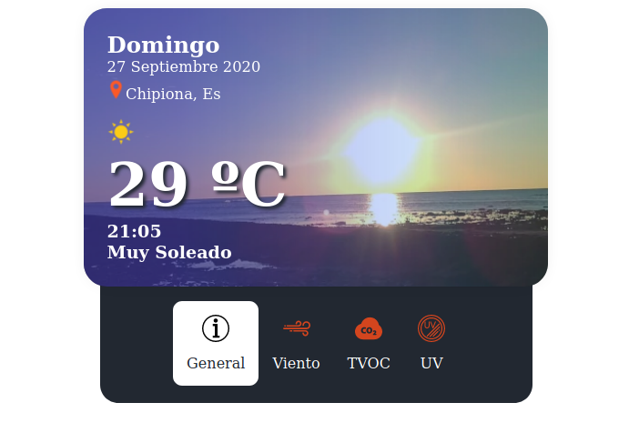
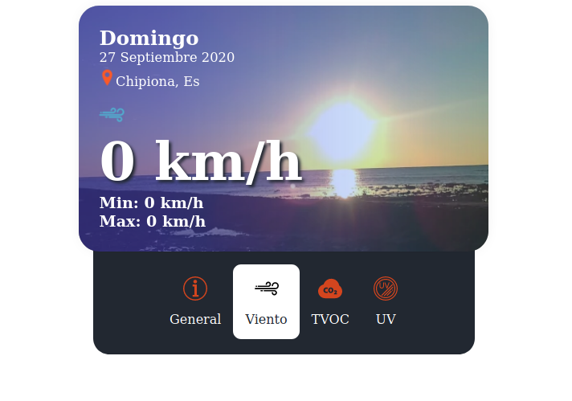
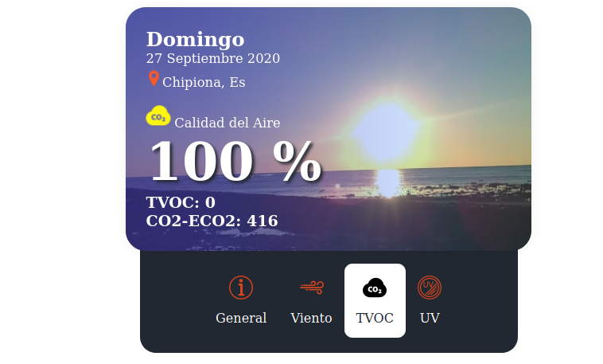
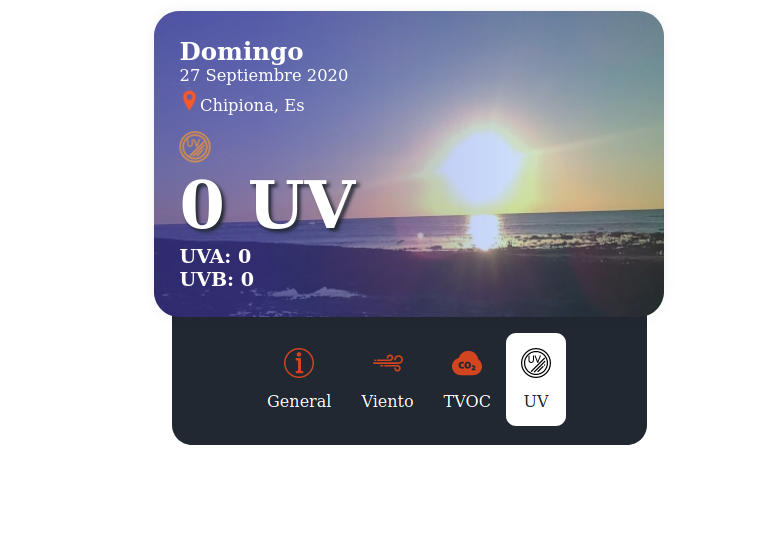

# Vue Component, Weather Chipiona

This component adds onu widget with weather information in the town of chipiona in real time (seconds of one minute from the last reading) returning information on temperature, wind, air quality and UVA / UVB rays.






## Project setup

```
npm install
```

## Build production

This creates the elements to include directly on the web.

```bash
npm run build
```

## Run develop watch

This raises a server component on port 8080 of localhost to develop it.

```bash
npm run serve
```

## Use Mode

Para comenzar necesitas tener en tu proyecto (o por lo menos en la página
dónde usarás este componente) vue.js insertado.

Necesitas tener la llamada al script, utiliza la ruta adecuada según si lo
descargas a tu proyecto, usas un cdn o lo traes desde npm.

```html
<script src="./v-weather-chipiona.js"></script>
```

Una vez tienes Vue.js y la llamada al componente en tu web, puedes crear un
bloque para añadir este componente dentro de él usando la etiqueta
**<v-weather-chipiona></v-weather-chipiona>**

## Demo example

```html
<!DOCTYPE html>
<html lang="en">
  <head>
    <meta charset="utf-8" />
    <title>Demo</title>
    <script src="../node_modules/vue/dist/vue.js"></script>
    <script src="./v-weather-chipiona.js"></script>
  </head>

  <body>
    <div id="app">
      <v-weather-chipiona></v-weather-chipiona>
    </div>
  </body>

  <script>
    var app = new Vue({
      el: "#app",
    });
  </script>
</html>
```
